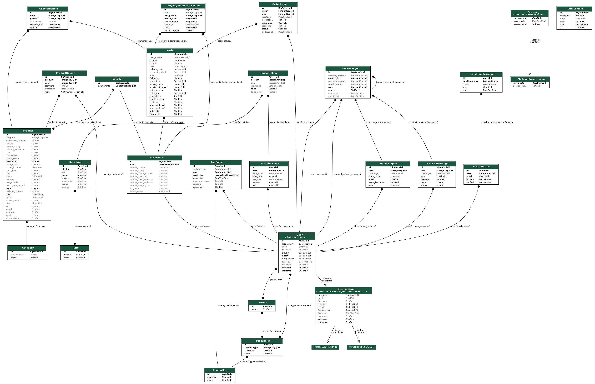
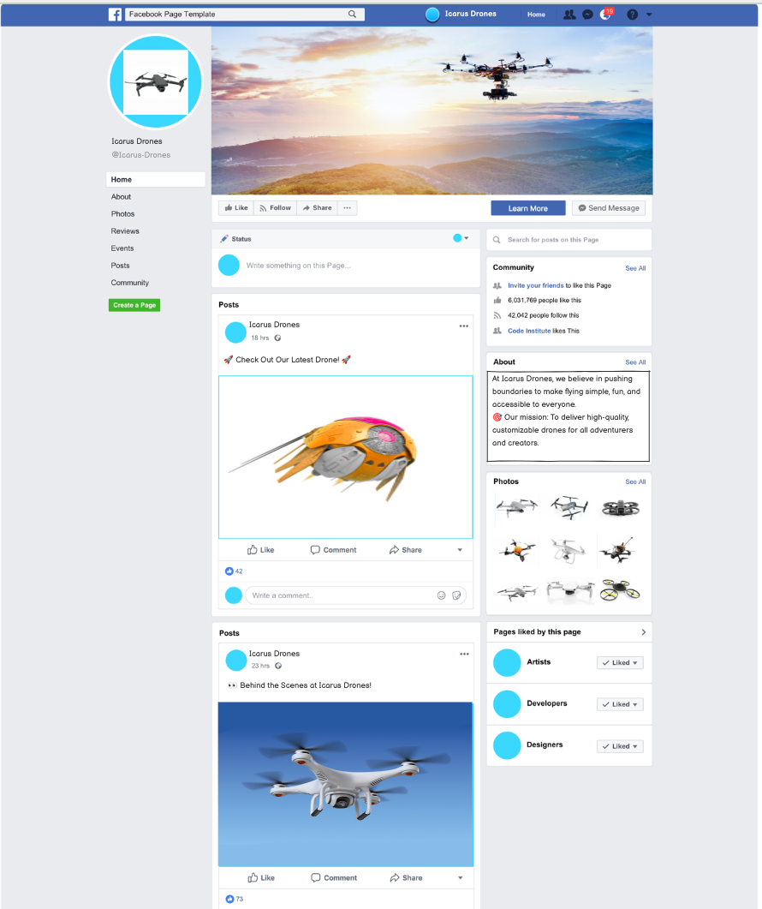
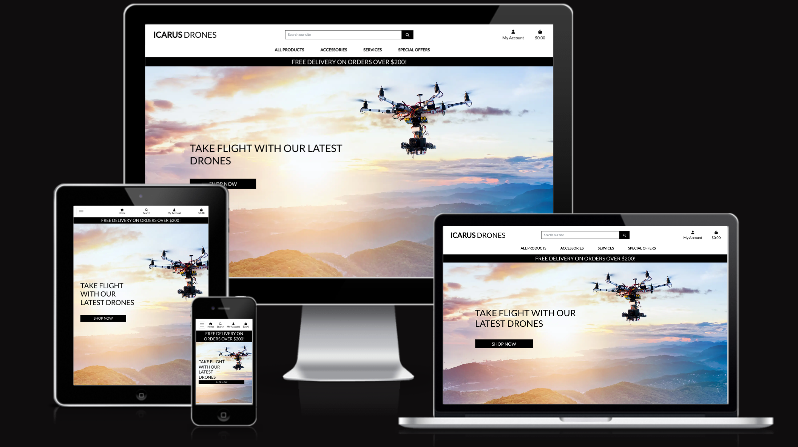

# Icarus Drones

A comprehensive e-commerce platform for drone enthusiasts, offering advanced features like product customization, loyalty points, drone comparisons, messaging systems, and product management. Designed to cater to different user roles, including customers, staff, and superusers, Icarus Drones provides a seamless and engaging shopping experience.

---

## Table of Contents

1. [Overview](#overview)
2. [Features](#features)
   - [General Features](#general-features)
   - [User Features](#user-features)
   - [Staff Features](#staff-features)
3. [User Stories](#user-stories)
   - [Customer Stories](#customer-stories)
   - [Staff Stories](#staff-stories)
   - [Superuser Stories](#superuser-stories)
4. [E-commerce Business Model](#e-commerce-business-model)
5. [Technologies Used](#technologies-used)
6. [Installation](#installation)
7. [Usage](#usage)
8. [Database Schema](#database-schema)
9. [Social Media Mockup](#social-media-mockup)
   - [Facebook Mockup](#facebook-mockup)
10. [Testing](#testing)
    - [Manual Testing](#manual-testing)
11. [SEO Keywords](#seo-keywords)
    - [Short-Tail Keywords](#short-tail-keywords)
    - [Long-Tail Keywords](#long-tail-keywords)
12. [Deployment](#deployment)
13. [Credits](#credits)
14. [License](#license)

---

## Overview

Icarus Drones is an innovative e-commerce platform offering 314 drone-related products, including customizable drones, accessories, and cameras. Designed to meet the needs of both drone enthusiasts and staff, the website features loyalty programs, messaging systems, and advanced product management tools. Customers can personalize drones, compare specifications, and manage their profiles, while staff can handle inquiries, repairs, and orders efficiently.

---

## Features

### General Features

- Fully responsive design for desktop, tablet, and mobile.
- Secure authentication and authorization.
- Dynamic navigation tailored to user roles (unregistered, registered, staff, superuser).
- Social media links and newsletter subscription in the footer.
- Category filters for efficient product browsing.
- Comprehensive email system for registrations, purchases, and messaging responses.

### User Features

- **Customizable Drones:**
  - Select drone colors dynamically and view updated images.
  - Add attachments like cameras, VR goggles, and advanced accessories.
- **Loyalty Points:**
  - Earn points with every purchase.
  - Redeem points for discounts at checkout.
- **Drone Comparison:**
  - Compare specifications of multiple drones side-by-side.
- **Profile Management:**
  - View and update delivery and personal information.
  - Manage wishlists (add/remove items).
  - Delete accounts securely.
- **Order Management:**
  - View order history with detailed information.
  - Raise issues or inquiries related to orders.
- **Messaging System:**
  - Contact staff for support, including repair requests.
  - Receive email confirmations for staff responses.
  - Respond directly to staff using the messaging system.
- **Product Reviews:**
  - Write and view reviews for drones and accessories.
- **Checkout System:**
  - Secure checkout with Stripe integration.
  - Dynamic bag with cost calculations, including delivery fees and loyalty discounts.

### Staff Features

- **Product Management:**
  - Add, edit, and delete products in various categories.
- **Message Management:**
  - View and respond to customer messages (e.g., inquiries, repair requests, and order issues).
  - Mark messages as resolved or unresolved for better tracking.
- **Permissions Management:**
  - Assign roles and permissions for product-related actions.

### Superuser Features

- **Staff Management:**
  - Control permissions for staff users.
- **Data Overview:**
  - Monitor customer interactions, product updates, and inquiries.
- **Reporting:**
  - Analyze loyalty points usage and sales performance.
- **Account Management:**
  - Delete user accounts upon request for secure data handling.

---

## User Stories

## Customer User Stories

<details>
<summary>1. Register and Manage My Account</summary>

**As a** shopper  
**I want to** register for an account, log in, and manage my profile  
**So that** I can track my orders and manage my details

**Acceptance Criteria:**
- Register for an account with email
- Log in and out securely using credentials
- Reset password securely if needed
</details>

<details>
<summary>2. Filter, Search, and Sort Drone Products</summary>

**As a** shopper  
**I want to** filter, search, and sort drone products  
**So that** I can find products that meet my preferences

**Acceptance Criteria:**
- Filter products by categories (e.g., recreational, professional), price, specifications
- Search for specific drone models or features
- Sort products based on price, popularity, or new arrivals
</details>

<details>
<summary>3. Secure Payment and Checkout</summary>

**As a** site user  
**I want to** checkout and complete my purchase  
**So that** I can finalize my order securely

**Acceptance Criteria:**
- Securely input payment details via Stripe during checkout
- Verify order details (items, total price, shipping) before payment
- Receive confirmation email with order details
</details>

<details>
<summary>4. View Product Reviews</summary>

**As a** site user  
**I want to** view customer reviews and ratings on product pages  
**So that** I can make informed decisions before purchasing

**Acceptance Criteria:**
- View list of customer reviews and ratings on each product page
- Sort reviews by rating
- See average rating for a product
</details>

<details>
<summary>5. Submit Product Reviews</summary>

**As a** shopper  
**I want to** submit reviews for purchased products  
**So that** I can share my feedback and help other customers make informed decisions

**Acceptance Criteria:**
- Write review and give rating for purchased products
- See reviews from other customers on product detail page
- Filter ratings
</details>

<details>
<summary>6. Add, Remove, and Update Items in Shopping Bag</summary>

**As a** shopper  
**I want to** manage the items in my shopping bag  
**So that** I can adjust my purchase before checking out

**Acceptance Criteria:**
- Add items from product detail page
- Remove items or update quantity in shopping bag
- See total price, including taxes and shipping, update as modifications are made
</details>

<details>
<summary>7. View Past Orders and Payment Statuses</summary>

**As a** shopper  
**I want to** view my past orders and payment statuses  
**So that** I can keep track of my purchases and payment outcomes

**Acceptance Criteria:**
- View details of past orders (product names, quantities, loyalty points, amounts)
- Check payment status of past orders
- Access order history at any time from account
</details>

<details>
<summary>8. Explore Product Categories</summary>

**As a** site user  
**I want to** search and filter products  
**So that** I can easily find drones that fit my needs

**Acceptance Criteria:**
- Browse products by categories or keywords
- Filter results by specifications, price, or type
- See product information, descriptions, specifications, and reviews
</details>

<details>
<summary>9. View Drone Products and Promotions</summary>

**As a** shopper  
**I want to** view a list of drone products  
**So that** I can select ones I'm interested in purchasing

**Acceptance Criteria:**
- Browse products categorized by type
- View promotional banners highlighting sales
- Navigate between sections including bundles and deals
</details>

<details>
<summary>10. Explore Drone Products and Business Information</summary>

**As a** site user  
**I want to** view general information about products and business  
**So that** I can understand what the site offers

**Acceptance Criteria:**
- Explore business information and drone categories
- View featured and promoted products on homepage
- Navigate between categories, promotions, and info pages
</details>

<details>
<summary>11. Manage Shopping Bag</summary>

**As a** site user  
**I want to** review and update items in my shopping bag  
**So that** I can ensure my order is accurate

**Acceptance Criteria:**
- View shopping bag contents anytime
- Update quantities or remove items
- See total price including loyalty points and shipping fees
</details>

<details>
<summary>12. Custom Drone Configuration</summary>

**As a** customer  
**I want to** customize my drone's color and add attachments  
**So that** I can personalize my drone to match my preferences

**Acceptance Criteria:**

*Color Customization*
- Select from 9 different color options
- See dynamic image updates reflecting selected color
- View color selection in toast messages
- Color choice persists in shopping bag
- Current selection clearly visible during customization

*Attachment Selection*
- View available attachments with prices
- Add/remove multiple attachments
- Price updates in bag with attachments
- Each attachment appears in toast message and cart
</details>

<details>
<summary>13. Customer Order Issue Reporting</summary>

**As a** customer  
**I want to** report issues with my orders  
**So that** I can get help resolving problems with purchases

**Acceptance Criteria:**

*Issue Reporting*
- Access order history in profile
- Select specific orders to report issues
- Choose from predefined issue categories
- Select "Other" category if needed
- Provide detailed description

*Communication Flow*
- Receive email confirmation when submitted
- Get email notifications for staff responses
- View full message history
- Respond directly to staff messages
- Track issue status (resolved/in progress)
</details>

<details>
<summary>14. User Profile Management</summary>

**As a** customer  
**I want to** manage my profile and account settings  
**So that** I can maintain my information and preferences

**Acceptance Criteria:**

*Profile Information*
- View/update personal information
- Add/edit delivery information
- Save delivery details for future
- Receive success notifications

*Account Deletion*
- Access deletion option
- See warning about losing points
- Confirm deletion intention
- Receive confirmation email
</details>

<details>
<summary>15. Wishlist Functionality</summary>

**As a** customer  
**I want to** manage my wishlist through a heart icon  
**So that** I can save products for later

**Acceptance Criteria:**

*Visual Interaction*
- Heart icon on product cards and detail pages
- Empty/filled states show wishlist status
- Dynamic color changes without refresh
- Easily clickable on all devices

*Wishlist Management*
- Add/remove items via heart icon
- View dedicated wishlist page
- Add items to cart from wishlist
- Toast messages confirm actions
</details>

<details>
<summary>16. Contact Us</summary>

**As a** site user  
**I want to** access a contact page  
**So that** I can reach the business for support

**Acceptance Criteria:**
- View contact form
- See business contact information
- Receive submission confirmation
</details>

<details>
<summary>17. Loyalty Points System</summary>

**As a** customer  
**I want to** earn and redeem loyalty points  
**So that** I can get discounts on purchases

**Acceptance Criteria:**

*Earning Points*
- Earn points based on purchase value
- View points on checkout page
- Points automatically added to profile
- See points in confirmation emails

*Redeeming Points*
- Redeem points during checkout
- See available points balance
- View discount calculations
- Cannot exceed available points

*Dynamic Updates*
- Total updates with point redemption
- Clear display of discounts
- Final total shown before purchase
</details>

<details>
<summary>18. Drone Specification Comparison</summary>

**As a** customer  
**I want to** compare drone specifications side by side  
**So that** I can make informed decisions before purchasing

**Acceptance Criteria:**
- Select up to 3 drones to compare
- View drones side by side with specifications
- Add/remove drones from comparison
- Add compared drones to cart or wishlist
- Automatically populated comparison data
- Clear all option available
- Access from listings and detail pages
- Clear format highlighting key differences
</details>

## Staff User Stories

<details>
<summary>19. Staff Message Management</summary>

**As a** staff member  
**I want to** manage customer issues through a centralized system  
**So that** I can efficiently handle customer concerns

**Acceptance Criteria:**

*Message Organization*
- View all customer messages in one system
- Filter by category (repairs/contact/issues)
- Sort by status (new/in progress/resolved)
- Access full order details
- View complete message history

*Issue Management*
- Respond to messages
- Mark issues as "in progress" or "resolved"
- Reopen resolved issues
- Track customer history
</details>

<details>
<summary>20. Product Management</summary>

**As a** staff member  
**I want to** manage products with Custom Drone Guidelines  
**So that** I can maintain accurate product catalog

**Acceptance Criteria:**

*Add Products*
- Add products through frontend form
- Complete required fields
- Upload images
- View Custom Drone Guidelines
- Receive confirmation messages

*Edit/Delete*
- Edit existing products
- Delete with confirmation
- See immediate website updates
- Access admin panel options
</details>

<details>
<summary>21. Staff Permission Management</summary>

**As a** superuser  
**I want to** manage staff permissions and credentials  
**So that** I can control access levels and security

**Acceptance Criteria:**
- Add new staff credentials
- Remove staff access
- Modify permission levels
- Assign specific permissions for:
 - Message management
 - Product management
 - Order management
 - Customer service
- Immediate permission updates
</details>

---

## E-commerce Business Model

### Business Model Overview
Icarus Drones operates as a B2C (Business to Consumer) e-commerce platform, specializing in the retail sale of drones and drone accessories to individual consumers. The platform targets both hobbyist drone enthusiasts and professional users looking for high-quality drone equipment.

### Target Market
- Recreational drone enthusiasts
- Professional photographers and videographers
- Commercial drone operators
- First-time drone buyers
- Tech-savvy consumers interested in customizable technology

### Core Business Strategy
- Offering customizable drone solutions with a unique color and attachment selection system
- Building customer loyalty through a points-based reward program
- Providing comprehensive product comparisons to aid purchase decisions
- Focusing on excellent customer service through multiple support channels
- Creating an engaging shopping experience with interactive product features

### Marketing Strategy
1. **Customer Retention**
   - Loyalty points program rewarding repeat purchases
   - Regular email newsletters featuring new products and promotions
   - Personalized shopping experiences based on user preferences

2. **Customer Acquisition**
   - SEO-optimized product descriptions and categories
   - Social media integration and sharing capabilities
   - Featured products and promotional banners
   - Easy-to-use product comparison tools

3. **Value Proposition**
   - Unique drone customization options
   - Competitive pricing with loyalty rewards
   - Expert product support and advice
   - Comprehensive product specifications and comparisons
   - Secure and convenient shopping experience

### Revenue Streams
- Direct product sales
- Drone accessories and attachments
- Custom drone configurations
- Extended warranties and service plans

---

## Technologies Used

- **Languages:** Python, HTML, CSS, JavaScript.
- **Frameworks:** Django, Bootstrap.
- **Database:** PostgreSQL.
- **Payment Integration:** Stripe.
- **Email Service:** Gmail SMTP.
- **Storage:** AWS S3.
- **Other Tools:** Git, Gitpod, Mailchimp.

---

## Installation

1. Clone the repository:
   ```bash
   git clone <repository-url>

---

## Database Schema

The following diagram represents the database schema of the application:



---

## Manual Testing

| Feature | Test Case | Expected Outcome | Actual Outcome | Pass/Fail |
|---------|-----------|------------------|----------------|-----------|
| **User Registration** | | | | |
| | Enter valid registration details | Account created, confirmation email received | As expected | Pass |
| | Enter invalid email format | Error message displayed | As expected | Pass |
| | Enter mismatched passwords | Error message displayed | As expected | Pass |
| | Submit empty form | Form validation errors shown | As expected | Pass |
| **User Login** | | | | |
| | Enter valid credentials | Successfully logged in, redirected to home | As expected | Pass |
| | Enter invalid password | Error message displayed | As expected | Pass |
| | Enter non-existent email | Error message displayed | As expected | Pass |
| **User Logout** | | | | |
| | Click logout button | User logged out, session ended | As expected | Pass |
| **Navigation & Browsing** | | | | |
| | Click 'Shop Now' button | Redirected to products page | As expected | Pass |
| | Use search function | Products matching keywords shown | As expected | Pass |
| | Click 'All Products' | Complete product list displayed | As expected | Pass |
| **Product Filtering/Sorting** | | | | |
| | Filter to show 20 products | 20 products displayed | As expected | Pass |
| | Filter to show 50 products | 50 products displayed | As expected | Pass |
| | Filter to show 100 products | 100 products displayed | As expected | Pass |
| | Filter to show all products | All products displayed | As expected | Pass |
| | Sort price high to low | Products ordered by descending price | As expected | Pass |
| | Sort price low to high | Products ordered by ascending price | As expected | Pass |
| | Sort rating high to low | Products ordered by descending rating | As expected | Pass |
| | Sort rating low to high | Products ordered by ascending rating | As expected | Pass |
| | Sort name A-Z | Products ordered alphabetically | As expected | Pass |
| | Sort name Z-A | Products ordered reverse alphabetically | As expected | Pass |
| | Sort categories A-Z | Categories ordered alphabetically | As expected | Pass |
| | Sort categories Z-A | Categories ordered reverse alphabetically | As expected | Pass |
| | Use pagination | Navigate through product pages | As expected | Pass |
| **Product Purchase** | | | | |
| | Add item to cart | Item added, toast notification shown | As expected | Pass |
| | Update quantity in cart | Quantity and total updated | As expected | Pass |
| | Remove item from cart | Item removed, total updated | As expected | Pass |
| | Complete checkout process | Order confirmed, email received | As expected | Pass |
| **Loyalty Points** | | | | |
| | Earn points on purchase | Points added to account | As expected | Pass |
| | Redeem points at checkout | Discount applied to total | As expected | Pass |
| | View points balance | Accurate points displayed in profile | As expected | Pass |
| | Attempt to use more points than available | Error message displayed | As expected | Pass |
| **Custom Drone Configuration** | | | | |
| | Select drone color | Image updates to match selection | As expected | Pass |
| | Add attachments | Price updates with selections | As expected | Pass |
| | Remove attachments | Price updates correctly | As expected | Pass |
| | Select different colors | Drone image updates dynamically | As expected | Pass |
| | Add attachments | Price updates accordingly | As expected | Pass |
| **Profile Management** | | | | |
| | Update personal information | Information saved successfully | As expected | Pass |
| | Add delivery address | Address saved to profile | As expected | Pass |
| | Delete saved address | Address removed from profile | As expected | Pass |
| | View order history | Complete order information displayed | As expected | Pass |
| | Report specific order issue | Issue reported successfully | As expected | Pass |
| | Delete account | Warning shown about loyalty points | As expected | Pass |
| | Confirm account deletion | Account successfully deleted | As expected | Pass |
| **Wishlist** | | | | |
| | Add item to wishlist | Item added, heart icon filled | As expected | Pass |
| | Remove from wishlist | Item removed, heart icon empty | As expected | Pass |
| | Move item from wishlist to cart | Item added to cart successfully | As expected | Pass |
| | Check wishlist status across pages | Heart icon status consistent across all pages | As expected | Pass |
| **Product Reviews** | | | | |
| | Submit product review | Review posted, visible on product | As expected | Pass |
| | Rate product | Rating added to product average | As expected | Pass |
| **Order Management** | | | | |
| | View order history | All past orders displayed | As expected | Pass |
| | View order details | Correct order information shown | As expected | Pass |
| | Report order issue | Issue submitted, confirmation received | As expected | Pass |
| **Support Requests** | | | | |
| | Submit drone repair request | Request sent, email confirmation received | As expected | Pass |
| | Submit with empty fields | Form validation errors shown | As expected | Pass |
| | Submit with invalid email | Email format error shown | As expected | Pass |
| | Submit contact request | Request sent, email confirmation received | As expected | Pass |
| **Toast Messages** | | | | |
| | Perform any interaction | Relevant toast message displayed | As expected | Pass |
| **Staff Features** | | | | |
| | Add new product | Product added to database | As expected | Pass |
| | Edit product details | Changes saved successfully | As expected | Pass |
| | Delete product | Product removed from site | As expected | Pass |
| | Respond to customer message | Response sent, status updated | As expected | Pass |
| | Toggle table/card view | Display changes accordingly | As expected | Pass |
| | View order issues | Listed oldest to newest | As expected | Pass |
| | Respond to order issue | Response sent successfully | As expected | Pass |
| | Change issue status | Status updates (in progress/resolved) | As expected | Pass |
| | View repair requests | Access all repair requests | As expected | Pass |
| | Respond to repair request | Response sent successfully | As expected | Pass |
| | Change repair status | Status updates (in progress/resolved) | As expected | Pass |
| | View contact messages | Access all contact messages | As expected | Pass |
| | Respond to contact | Response sent successfully | As expected | Pass |
| **Staff Permissions** | | | | |
| | Add staff permissions | User granted staff access | As expected | Pass |
| | Remove staff credentials | Staff access revoked | As expected | Pass |
| **Search and Filter** | | | | |
| | Search by keyword | Relevant results displayed | As expected | Pass |
| | Filter by category | Correct products shown | As expected | Pass |
| | Sort by price | Products ordered correctly | As expected | Pass |
| **Responsive Design** | | | | |
| | View on mobile device | Layout adjusts appropriately | As expected | Pass |
| | View on tablet | Layout adjusts appropriately | As expected | Pass |
| | View on desktop | Layout displays correctly | As expected | Pass |

---

## SEO Keywords

### **Short-Tail Keywords**
- Drones
- Buy drones
- Drone accessories
- Custom drones
- Drones for sale
- Drone comparison
- Drone repair
- Drone reviews
- Loyalty points
- Drone cameras
- Professional drones
- Buy drones online
- High-quality drones for sale
- Best drones for beginners
- Professional drones for photography
- Drone e-commerce platform
- Online drone store

---

### **Long-Tail Keywords**

#### **Customizable Drones**
- Build your custom drone
- Design your own drone
- Custom drone colors
- Drone customization options
- Customizable drones with attachments
- Create your drone with unique features
- Custom drone accessories
- Personalize your drone online
- Custom drone builder tool
- Drones with customizable parts
- Personalized drones with color and add-ons
- Buy custom drones with unique attachments
- How to customize your drone with attachments

#### **Drone Accessories**
- Buy drone attachments online
- Drone cameras and VR goggles
- Drone carry cases for sale
- Best drone batteries and chargers
- Propellers and blades for drones
- Essential drone accessories
- Affordable drone add-ons
- Premium drone accessories
- Drone accessories including cameras and batteries
- Affordable drone cameras and VR goggles

#### **Loyalty Program**
- Earn loyalty points with drone purchases
- Drone store with rewards program
- Redeem loyalty points for discounts
- Drone loyalty rewards
- Drone shopping with benefits
- Best drone loyalty program online
- Earn loyalty points with every drone purchase
- Drone shopping with rewards and discounts

#### **Drone Comparisons**
- Compare drone specifications
- Side-by-side drone comparison tool
- Best drones compared online
- Drone specification highlights
- Drone comparison features
- Compare drone specifications side by side
- Easy-to-use drone comparison tools

#### **Customer Support**
- Drone repair services online
- Contact us for drone inquiries
- Drone troubleshooting support
- Online drone repair booking
- Drone customer service platform
- Hassle-free drone repairs
- Advanced drone repair and maintenance services

#### **Target Audience**
- Drones for beginners
- Professional drones for photographers
- Drones for commercial use
- Tech-savvy drone enthusiasts
- Affordable drones for hobbyists
- High-tech drones for professionals
- Best drones for beginners and professionals
- Affordable drones for recreational use
- Find drones for hobbyists and professionals
- Professional drones for commercial applications

#### **User Experience**
- Secure online drone shopping
- Easy checkout with Stripe
- Manage drone orders online
- Drone shopping with reviews
- Wishlist for drone enthusiasts
- Manage your drone profile
- Secure online drone shopping platform

#### **Promotional and Engagement Keywords**
- Best drone deals online
- Top-rated drones for sale
- Exclusive drone promotions
- Featured drones and accessories
- Sign up for drone newsletter
- Drone giveaways and promotions
- Best drone deals and promotions online

---

## Social Media Mockup

### Facebook Mockup
The image below showcases the design and layout of our Facebook promotional material for Icarus Drones. This mockup highlights our branding and marketing strategy to attract drone enthusiasts on social media platforms.







